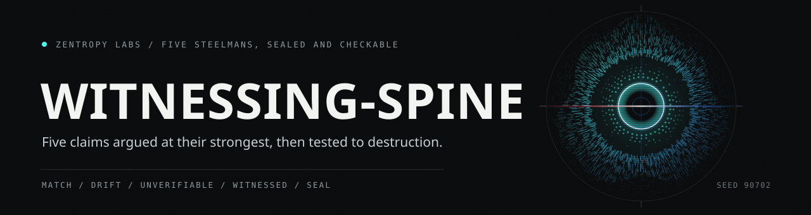

<p align="center">
  
</p>

# The Witnessing Spine

### Five adversarial steelmans in financial-sector technology, and a cross-sector convergence on verifiable trust

**Author:** Zain Dana Harper · independent researcher, Seattle · ORCID [0009-0001-7175-5393](https://orcid.org/0009-0001-7175-5393)
**License:** [CC-BY-4.0](https://creativecommons.org/licenses/by/4.0/) · **DOI:** [10.5281/zenodo.20778927](https://doi.org/10.5281/zenodo.20778927)
**Companion:** *Conferred Existence* (philosophy corpus) — [Zenodo 10.5281/zenodo.20773724](https://doi.org/10.5281/zenodo.20773724)

---

## The thesis

**Nothing self-warrants.** Every property worth trusting — provenance, equivalence, alpha, safety, assurance — is conferred from outside the thing that claims it, and must be **witnessed** (re-derived from primary evidence, coverage-accounted, stamped MATCH / DRIFT / UNVERIFIABLE) rather than **asserted** by the thing itself. Across five independent sectors of financial-sector technology, the same structural gap appears between a *verified-looking artifact* and the *property it is taken to warrant* — and the same discipline closes it.

![Eight stages of one adversarial steelman: claim, agents, sources, retrieval, maturity, excluded, verdict, and gap. Each run begins by building the strongest honest version of an industry claim rather than the weakest. Four parallel web-grounded searches run against it, roughly two hundred tool calls apiece. Between sixty and eighty-five sources survive deduplication in a given run. Every citation is checked against a primary or reputable record before it is used. The method names eight maturity labels, from peer-reviewed through preprint, standard, gov, primary-legal, incident, gray-lit, and data, and all five runs carry them inline. Anything that could not be confirmed is marked unverified in place and excluded from load-bearing use, which is why several named figures appear in the runs only as things that were dropped. The verdict is stated as partial or false as stated, with the reason attached. What remains is the gap: the named distance between an artifact that looks verified and the property it was taken to warrant. Three outcomes: partial, false as stated, and an open bid.](docs/art/steelman-lane.svg)

## What's inside

Five adversarial steelmans — each takes the strongest honest case *for* an industry claim, then tests it to destruction against the primary literature — plus a synthesis that bridges them.

| # | Sector | Claim steelmanned | Verdict | The gap |
|---|---|---|---|---|
| 001 | AI provenance | "documentation + signing satisfies provenance obligations" | partial; fails at verification | **authentication ≠ authorization** |
| 002 | COBOL modernization | "GenAI is production-ready to modernize core-banking COBOL at scale" | FALSE as stated | **translation ≠ equivalence** |
| 003 | Quant / ML | "deep ML reliably beats classical methods out-of-sample" | FALSE as stated | **backtest ≠ realized alpha** |
| 004 | DeFi | "DeFi is trustless — verification replaces intermediary trust" | FALSE as stated | **verification ≠ economic safety** |
| 005 | Enterprise software | "certifications + SLAs assure proprietary software" | FALSE as stated | **attestation ≠ assurance** |
| — | **Synthesis** | *The Witnessing Spine* | — | one gap, four altitudes |

**The ring:** Run 005's supply-chain finding (*documented ≠ witnessed provenance*) is the same mechanism as Run 001's verifiable-AI-provenance finding. The last sector loops back to the first; the corpus is a closed loop whose invariant is the witnessing discipline.

![Twelve rows covering what this corpus holds and what each part settles. Run 001 on AI provenance lands at partial: documentation and signing were argued at their strongest, then failed where the claim had to be verified rather than shown. Run 002 on COBOL modernization, Run 003 on quantitative machine learning, Run 004 on DeFi, and Run 005 on enterprise attestation all land at false as stated, each for a different reason: translation is not proven equivalence, a backtest is not realized alpha, verifying a contract is not economic safety, and a certificate attesting to a scope on a date is not assurance about the system now. The accented row is the synthesis: its strongest claim, that the four altitudes share one gap rather than four similar ones, is labeled an abductive bid and not a deductive identity. The ring closes the corpus, because the supply chain finding in the last sector is the provenance finding in the first. About three hundred and thirty sources were retrieval checked, and eight maturity labels run from peer-reviewed down to data, carried inline by all five runs. Anything that did not confirm is marked in place and dropped from load-bearing use, and several corrections are logged where they happened. The seal is seven SHA-256 lines, one per document, re-derivable offline by the script that ships beside them.](docs/art/corpus-table.svg)

## Method & evidence discipline

- **Verify before cite.** Every citation was retrieval-checked against a primary or reputable source. Claims that could not be confirmed are marked UNVERIFIED and excluded from load-bearing use.
- **Never fabricate.** No invented citations, numbers, or quotations. "Unknown" beats a plausible guess. Several honest corrections are logged in-line (e.g., a mis-attributed quote downgraded to paraphrase; a "FedRAMP failure" reframed as a scope-divergence after spot-verification).
- **Maturity-labeled.** Every source carries `[peer-reviewed] / [preprint] / [standard] / [gov] / [primary-legal] / [incident] / [gray-lit] / [data]`.
- **~330 verified sources** across arXiv, IACR ePrint, IEEE S&P / ACM CCS / USENIX / WWW / AFT / FC, NBER, BIS, and primary records from the SEC, CFTC, FBI, ICO, GAO, NIST, and CISA.

## AI-assisted disclosure

This is AI-assisted research substrate. Web-grounded research agents performed source discovery in parallel; the author performed synthesis, adjudication, and independent spot-verification of load-bearing claims. The synthesis's strongest claim — that the four altitudes are *the same* gap — is labeled an abductive bid, not a proof (see the synthesis §8). The work is published to stake a dated, citable claim and to invite the adversarial scrutiny that would break it if it deserves breaking. *Proof before trust — including about authorship.*

## Citation

> Harper, Z. D. (2026). *The Witnessing Spine: Five Adversarial Steelmans in Financial-Sector Technology and a Cross-Sector Convergence on Verifiable Trust.* Zenodo. https://doi.org/10.5281/zenodo.20778927

![Eight stages of checking the seal on this corpus: clone, manifest, parse, digest, compare, collect, rank, and exit. You clone the corpus together with the script that checks it, so the check needs nothing that is not already in front of you. The manifest holds nine lines, two of them comments and seven of them digests, one per document. The parser skips blanks and comments and splits each remaining line on a two space separator; a line missing that separator, or carrying a digest that is not sixty-four characters long, is counted as unverifiable rather than passing. Every listed file is streamed through SHA-256 in sixty-four kilobyte blocks. The recorded digest is compared against the one just derived. Mismatches are collected apart from files that could not be read at all. A proven drift is ranked ahead of a missing file, so deleting a document cannot downgrade a tamper. The script prints one word and one line of detail, and exits zero, one or two. Three outcomes: match, drift, and unverifiable.](docs/art/seal-lane.svg)

## Contents

```
README.md                                  this file
SYNTHESIS-the-witnessing-spine.md          the grand bridge (start here)
RUN-001-verifiable-provenance-financial-ai.md
RUN-002-genai-cobol-modernization-equivalence.md
RUN-003-quant-ml-out-of-sample-steelman.md
RUN-004-defi-trustlessness-steelman.md
RUN-005-enterprise-attestation-assurance-steelman.md
MANIFEST.sha256                            integrity / priority manifest
verify_manifest.py                         re-derives every digest above
tests/test_verify_manifest.py              tests for the checker itself
docs/art/                                  the drawings on this page
```

Check the seal yourself, with nothing but a clone and a Python interpreter:

```bash
python verify_manifest.py
```

It prints `MATCH`, `DRIFT`, or `UNVERIFIABLE` and exits `0`, `1`, or `2`.

---

**[Zentropy Labs](https://github.com/ZentropyLabs-ai)** · order out of entropy. An independent lab building evidence-first tools that leave a re-checkable artifact behind. Built by Zain Dana Harper in Seattle. The full workbench is at [Project Telos](https://harperz9.github.io).
